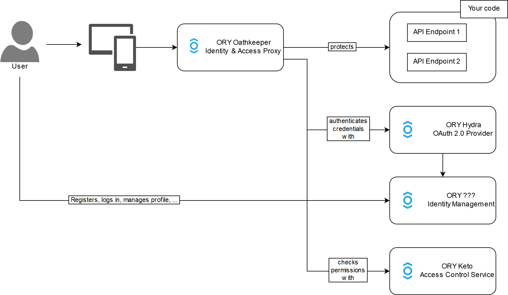

# ORY

## Overview

- ORY **Hydra** is an OAuth 2.0 and OpenID Connect provider
- ORY **Oathkeeper** is an Identity and Access Proxy
- ORY **Keto** is an access control server
- ORY **Kratos** is an identity management server

## Architecture

## Oauth2

### Grant Types

*Grant type* refers to the way an application gets an access token.
OAuth 2.0 extensions can also define new grant types.

> grant types

| type               | needed                                  | return       | deprecated |
|--------------------|-----------------------------------------|--------------|------------|
| client credentials | user/password - client_id/client_secret | access token | []         |
| authorization code |                                         |              | []         |
| device code        |                                         |              | []         |
| refresh            |                                         |              | []         |
| implicit           |                                         | access token | [x]        |
| password           |                                         | access token | [x]        |

> grant type decision tree

### Terminology

- `grant_type` : define which OAuth2 grant type is used
- `client_id` : public identifier of the application obtained during registration
- `client_secret` : secret of the application obtained during registration
- `scope` : name of the token's scope
- `access token` : the bearer token returned by the authorization server
- `refresh token` : the next bearer token when current one is outdated
- `resource owner` : mainly the user able to authenticate
- `resource server` : server hosting the protected resources (protected by access tokens)
- `client` : an application making protected resource requests on behalf of the resource owner and with its authorization
- `authorization server` : server issuing access tokens to the client after successfully authenticating the resource owner and obtaining authorization

## Links

- [documentation](https://www.ory.sh/docs/index)
- [helm charts](https://k8s.ory.sh/helm/)
- [oauth2 simplified](https://www.oauth.com/)
- [oauth2 grants](https://alexbilbie.com/guide-to-oauth-2-grants/)
